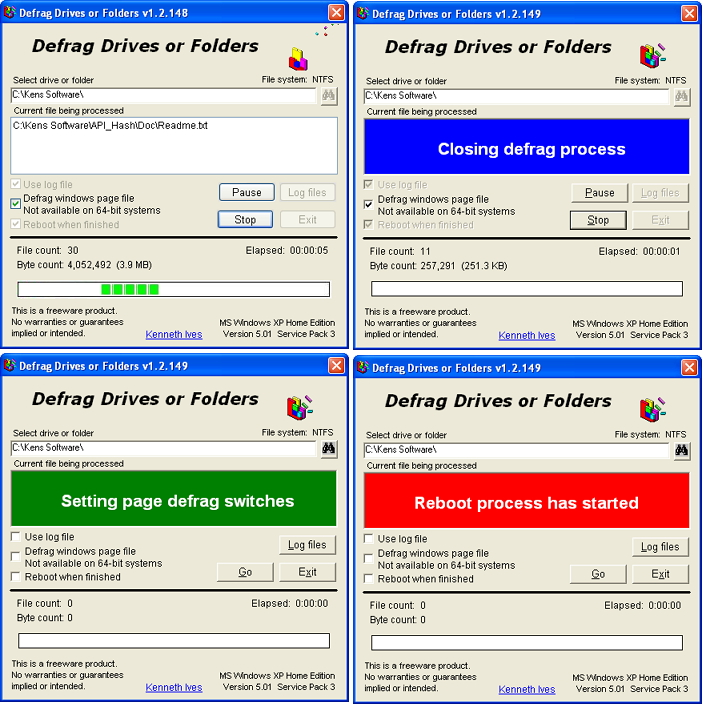



## Defrag drives or folders  30\-Mar\-2012

### Description

Defrag your drives using utilities written and supported by Microsoft Sysinternals. These are freeware and are located at

http://technet.microsoft.com/en-us/sysinternals/default.aspx

The names are Contig and PageDefrag listed under File and Disk.

=== 05-Jan-2012 Updated modProcesses.bas module. Finally resolved the problem of multiple instances of contig.exe displayed in task manager window.

=== 08-Mar-2012 Updated support modules

=== 30-Mar-2012 Updated documentation. Added modTrimStr.bas module.
 
### More Info
 

             |
---                |---
**Submitted On**   |2012-03-28 08:24:12
**By**             |[Kenaso](https://github.com/Planet-Source-Code/PSCIndex/blob/master/ByAuthor/kenaso.md)
**Level**          |Intermediate
**User Rating**    |5.0 (20 globes from 4 users)
**Compatibility**  |VB 6\.0
**Category**       |[Complete Applications](https://github.com/Planet-Source-Code/PSCIndex/blob/master/ByCategory/complete-applications__1-27.md)
**World**          |[Visual Basic](https://github.com/Planet-Source-Code/PSCIndex/blob/master/ByWorld/visual-basic.md)
**Archive File**   |[Defrag\_dri2222263292012\.zip](https://github.com/Planet-Source-Code/kenaso-defrag-drives-or-folders-30-mar-2012__1-73492/archive/master.zip)

